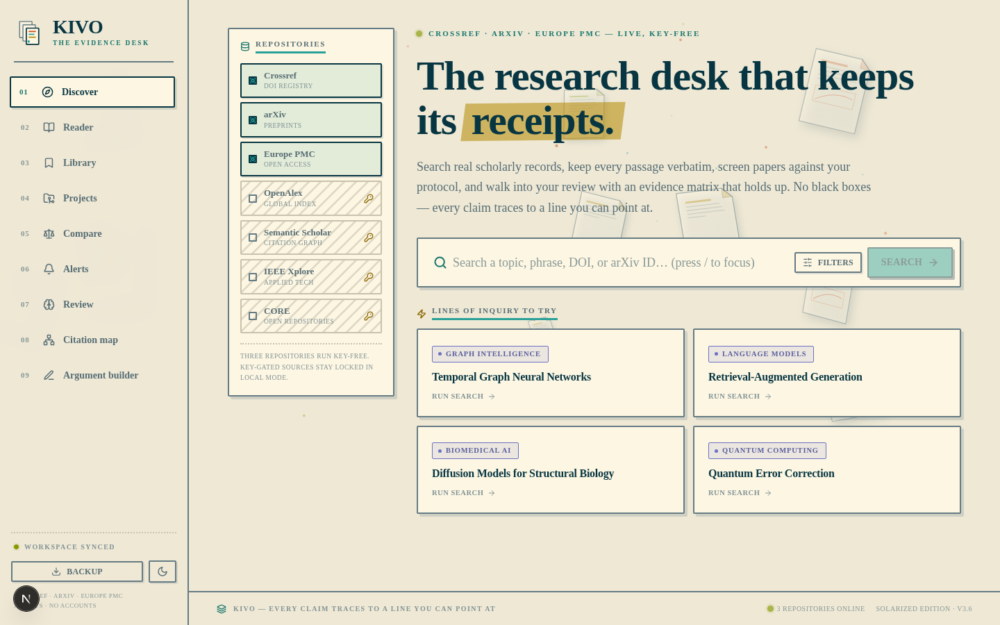
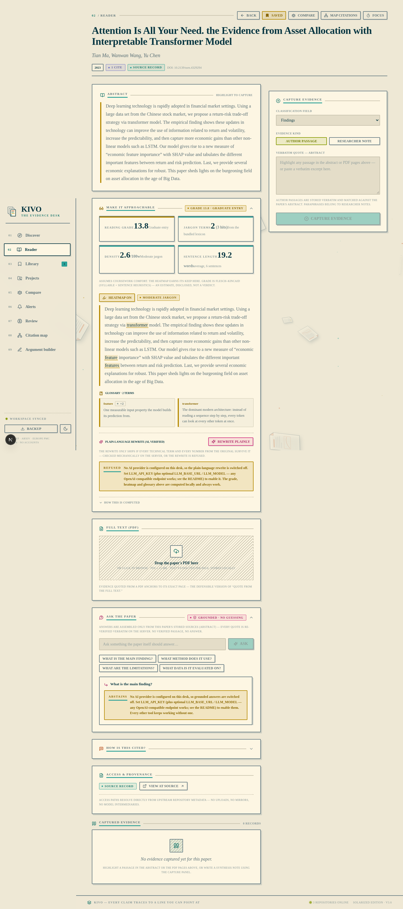
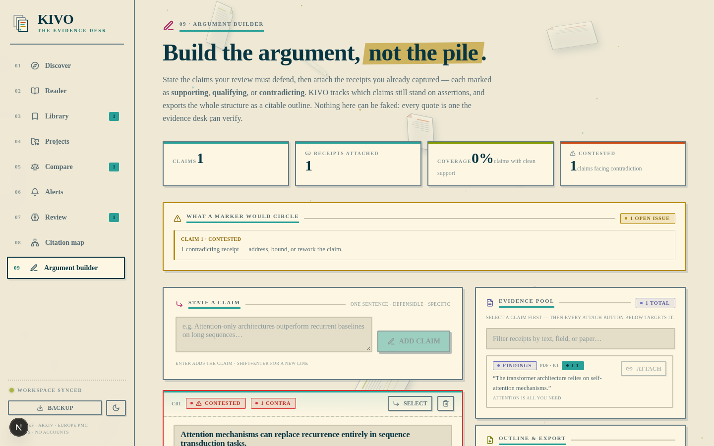
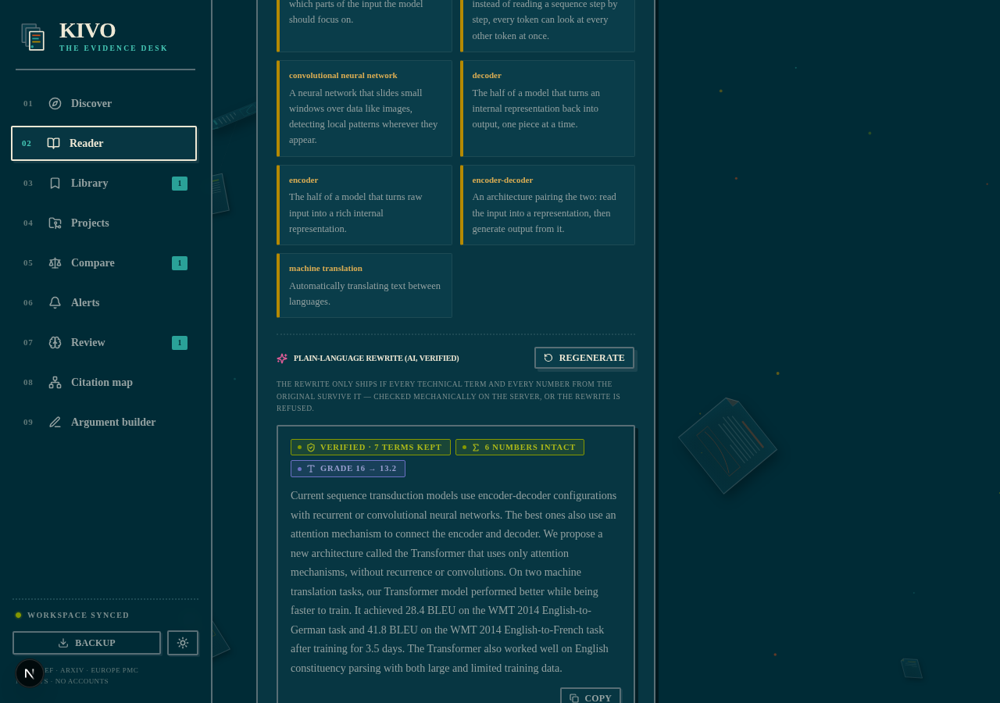
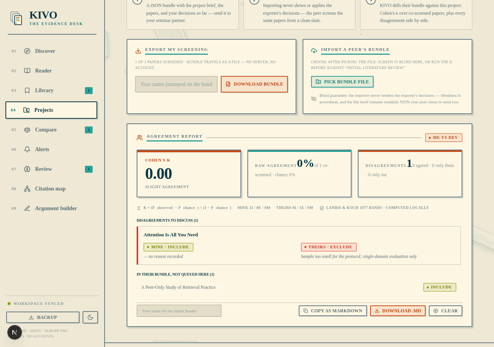
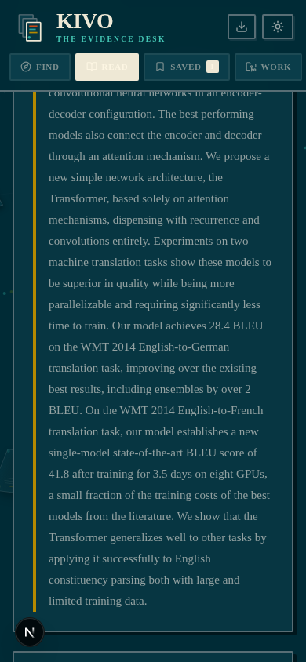

# KIVO — The Evidence Desk · Solarized Edition

A **local-first research workbench** for finding scholarly records, keeping
source passages, and organizing a literature review. Retrieval uses academic
APIs directly and works with AI disabled. Internet access is still required
for live search.

> **v3.7 — Own your AI.** The bundled AI middleware is gone: grounded Q&A
> and the plain-language rewrite now talk to **any OpenAI-compatible
> endpoint** you configure (`LLM_API_KEY` / `LLM_BASE_URL` / `LLM_MODEL` —
> OpenAI, Groq, Together, Mistral, DeepSeek, OpenRouter, or a local
> Ollama), and the desk runs **fully without any AI provider** — both
> surfaces abstain honestly instead of guessing. See
> [What changed in v3.7](#what-changed-in-v37).
>
> **v3.6 — Seminar & approachability.** The last two roadmap items land:
> blind peer screening with a **Cohen's κ agreement report** (seminar
> bundles travel as files, no server), and a reading-level layer with a
> jargon heatmap plus a plain-language rewrite under a no-distortion
> contract. The FUTURE_FEATURES roadmap is now fully shipped. See
> [What changed in v3.6](#what-changed-in-v36).
>
> **v3.4 — Grounded Q&A.** "Ask the paper" arrives with a hard
> no-hallucination contract: answers ship only with server-verified verbatim
> passages — otherwise the desk abstains. See
> [What changed in v3.4](#what-changed-in-v34).
>
> **v3.3 — The full-text layer.** Page-anchored evidence: upload a paper's
> PDF and every quote pins to its exact page. Plus smart citations (a
> transparent supporting/contrasting/mentioning classifier) and focus
> sessions with a 12-week activity streak. See
> [What changed in v3.3](#what-changed-in-v33).
>
> **v3.2 — Learning layer.** The desk now drills what you capture: every
> evidence item is an SM-2 flashcard (**Review**), and every paper can be
> mapped through its references and citations (**Citation map**). See
> [What changed in v3.2](#what-changed-in-v32).
>
> **v3.0 — The Solarized Redesign.** The interface has been completely
> rebuilt on a new design system ("The Paper Bench"). Nothing visual carries
> over from the previous edition except the beloved floating-papers
> background motion — every colour, font, layout, and component is new.
> See [What changed in v3.0](#what-changed-in-v30) below.

## Start locally

```sh
bun install        # or: npm ci
bun run dev        # or: npm run dev
```

Open **http://localhost:3000**. No database, Docker, or API keys are
required: the workspace is **browser-first** (localStorage/IndexedDB), and
the default sources (Crossref, arXiv, Europe PMC) are key-free. The server
is a lightweight relay that never overwrites your local research.

Optional extras (AI provider, Semantic Scholar key, gated academic
sources) are documented in **[`.env.example`](./.env.example)** — the app
never requires any of them.

## Screenshots

| | |
| --- | --- |
|  |  |
| *Discover — the desk, telemetry on* | *Reader — evidence, PDF, Q&A* |
|  |  |
| *Argument builder — claims & receipts* | *Reading level — verified rewrite* |
|  |  |
| *Seminar — Cohen's κ report* | *Mobile — reader panels at 390 px* |

## Research workflow

1. **Discover:** search by topic, quoted phrase, title, DOI, or arXiv ID.
   Inspect live per-source telemetry and explicit filters. Results rank by
   title/text relevance — not citation counts or publisher prestige.
2. **Save and compare:** save paper snapshots, or add up to eight papers
   from different searches to Compare. The comparison selection survives
   refresh.
3. **Projects:** record a question and criteria, add papers, screen
   include/exclude/maybe with reasons, and save reading status, tags, and
   notes. Every decision is recorded as an audit event.
4. **Reading:** inspect the abstract, highlight any passage, and capture it
   verbatim into Question, Method, Dataset/sample, Evaluation, Metrics,
   Findings, Limitations, Code/data, or Notes. Researcher notes remain
   separate from author passages.
5. **Evidence matrix:** inspect supporting passages from matrix cells.
   Missing evidence remains visibly missing (hatched cells). The matrix
   does not declare a study "best" when evaluations are incomparable.
6. **Export and revisit:** export evidence CSV, screening CSV, BibTeX,
   RIS, library JSON, and reproducible search records.
7. **Updates:** save a living search and press **Check now** to sweep the
   repositories on demand — newly discovered records land in your local
   inbox with unread badges.
8. **Review (v3.2):** every captured passage becomes a flashcard. Answer
   from memory, reveal the verbatim source, and grade Again / Hard / Good /
   Easy — an SM-2 scheduler (the Anki algorithm) spaces the returns. Streak
   and 30-day recall stats are computed from a local review log.
9. **Citation map (v3.2):** center any library paper on a force-directed
   map of its references (cyan) and citations (orange), sized by citation
   count, fetched live from the Semantic Scholar graph. Click a node to
   inspect, open it in the Reader, or re-center the map there.
10. **Full text (v3.3):** upload the paper's PDF (≤ 15 MB) in the Reader —
   text is extracted page by page, and any highlighted passage captures as
   evidence anchored to that exact page (`documentId` + `page`, re-verified
   verbatim forever).
11. **Smart citations (v3.3):** "How is this cited?" in the Reader pulls the
   real citation contexts and classifies each as supporting, contrasting, or
   mentioning — with the rule list shown in the UI so the classification is
   citable in a methods section.
12. **Focus & streaks (v3.3):** start a 25-minute focus session on any
   paper (live countdown, session capture tally), and watch a 12-week
   activity calendar + daily capture goal in Review.
13. **Ask the paper (v3.4):** grounded Q&A over the paper's stored text
   (abstract + extracted PDF pages). Every answer ships with verbatim
   receipts — click one to jump to the exact source and see it flash.
   Questions the sources can't answer get an honest ABSTAINS card
   instead of a guess. (Optional AI surface — bring any
   OpenAI-compatible provider, or run with it off.)
14. **Argument builder (v3.5):** state the claims your review must defend,
   then attach captured receipts to each — marked **supporting**,
   **qualifying**, or **contradicting**. KIVO tracks claim coverage (the
   nav badge counts claims still standing on assertions), flags contested
   claims, and exports the whole structure as a citable Markdown outline
   with verbatim quotes and citations inline.
15. **Reproducibility labels (v3.5):** per-paper "can I rerun this?"
   checklist (code linked · data public · seeds/hyperparams stated ·
   license) in the screening queue. Summarized as a ticket on paper cards
   ("Repro 2/3"), a matrix row in Compare, and columns in the screening
   CSV.
16. **Make it approachable (v3.6):** every abstract gets a Flesch–Kincaid
   reading grade, a jargon heatmap over a bundled ~130-term lexicon (hover
   any highlight for its plain-language gloss), and an AI plain-language
   rewrite that only ships when the server has mechanically verified every
   technical term and every number survived it — otherwise it's refused,
   honestly. (Grade, heatmap and glossary are pure local computation; the
   rewrite is an optional AI surface.)
17. **Seminar · peer κ (v3.6):** export your screening as a self-contained
   JSON bundle; a classmate imports it and screens **blind** (your
   decisions are never shown or applied); import their returned bundle to
   get a Cohen's κ chance-corrected agreement report with Landis & Koch
   interpretation, per-paper reason diffs side by side, and a Markdown
   export for the seminar minutes.

## What changed in v3.7 (provider-agnostic AI)

Kivo no longer ships with — or routes through — any bundled AI middleware.
The two AI surfaces became **bring-your-own-provider**, and the desk is
**fully usable with AI switched off**.

### Design

- **No vendor SDK in the request path.** A ~90-line client
  (`src/lib/llm.ts`) speaks the standard OpenAI chat-completions protocol
  over `fetch` — nothing else. No middleware, no proxy, no bundled
  account.
- **Works with anything.** Point it at OpenAI, Groq, Together, Mistral,
  DeepSeek, OpenRouter or a local Ollama / llama.cpp server:

  ```sh
  LLM_API_KEY=sk-…                     # any non-empty string for local servers
  LLM_BASE_URL=https://api.openai.com/v1
  LLM_MODEL=gpt-4o-mini
  ```

  `OPENAI_API_KEY` / `OPENAI_BASE_URL` / `OPENAI_MODEL` work as aliases,
  so existing provider setups need zero new configuration.
- **Honest when off.** With no key configured, both surfaces return a
  dedicated `not-configured` abstain (not an error, not a guess) with
  copy that says exactly how to switch them on. That state is never
  cached, so configuring a provider takes effect immediately.
- **The contracts are unchanged and provider-independent.** Grounded Q&A
  still verifies every quote as a verbatim substring of the retrieved
  passages before an answer can ship; the plain-language rewrite still
  verifies every technical term and every number survived it. Whoever the
  model is, the desk — not the model — decides what ships.

### Fixes & engineering

- **Citation map "cited by" side silently empty** — `/api/citations` picked
  the `references` array for every query (`"references" in result` always
  matched), so `type=cites` returned a guaranteed-empty list. The side is
  now selected by query type (verified live: cites went from 0 neighbors
  to real records). Caught by running `tsc --noEmit` over the whole tree —
  which now passes cleanly and runs in CI.
- Removed the `z-ai-web-dev-sdk` dependency entirely (`bun remove`); the
  app carries **zero AI-vendor packages**.
- Request timeouts moved from `Promise.race` scaffolding to a proper
  `AbortController` inside the client; the strict JSON / contract retries
  in both routes are preserved.
- The model-facing system prompt now uses the standard `system` role
  (the previous SDK expected a non-standard role for it).
- `/api/health` now reports the live AI surface status and provider label
  (`{ ai: { enabled, provider } }`) — never the key.
- Package renamed to `kivo` (v3.6.0) with a proper description; see
  [Optional configuration](#optional-configuration) for the full env-var
  table.

### Verification

- `bun run lint` clean; both routes contract-checked (validation, rate
  limits, abstain reasons, cache behaviour unchanged for the non-AI
  paths).
- E2E in the browser: reader Q&A panel and reading-level rewrite show
  the honest "not configured" abstains with the setup hint; search,
  capture, compare, review, seminar and exports all unaffected; zero
  console errors in both themes and at 390 px.

## What changed in v3.6 (seminar & approachability)

### New features

- **Reading level & jargon heatmap** (FUTURE_FEATURES #11).
  - `src/lib/reading/` — three new pure modules: `lexicon.ts` (bundled
    ~130-term CS/bio/methods glossary — static, auditable, versioned in
    the repo; no model involved in detection), `readability.ts`
    (Flesch–Kincaid grade via the vowel-group syllable heuristic, reading
    level labels, jargon density bands), `jargon.ts` (longest-first,
    plural-aware, non-overlapping term detection + lossless abstract
    segmentation — the roundtrip is exact by construction).
  - Reader panel **"Make it approachable"**: 2×2 stat strip (grade · term
    count · density per 100 words · sentence length), a toggleable heatmap
    that marks every detected term (hover for the gloss), a glossary grid
    of detected terms with one-sentence plain-language glosses, and a
    method disclosure (the FK formula + lexicon location).
  - **Plain-language rewrite (AI, verified)** — `POST /api/gloss` behind a
    **no-distortion contract** (the rewrite analogue of the Q&A
    no-hallucination contract): the model rewrites the abstract for a
    second-year student, and the server mechanically verifies that every
    term from the detected list and every number/statistic/year from the
    original appear in the rewrite — one strict retry naming the missing
    pieces, then an honest REFUSED card. Every rewrite shows its
    before/after FK grade (16 → 13 in verification) and a copy action.
    Cached in memory by (abstract, terms); rate-limited 10/min.
- **Seminar Mode — blind peer screening + Cohen's κ** (FUTURE_FEATURES #9).
  - `src/lib/workspace/seminar.ts`: self-contained bundle format
    `kivo-seminar-bundle/v1` (project brief + member paper metadata + the
    exporter's own decisions), `exportSeminarBundle`, `blindProjectFromBundle`,
    `cohenKappa` (chance-corrected agreement over co-screened pairs;
    handles the undefined-denominator cases honestly), `buildKappaReport`
    (disagreements, one-sided screenings, and bundle papers never queued
    locally), and `kappaMarkdown` (seminar-minutes export).
  - Projects view gains a third tab, **Seminar · peer κ**: a 3-step rail
    (export → blind screen → import back), an export card (reviewer name
    is stamped on the bundle; requires ≥1 screened paper), and an import
    card. Importing opens an explicit fork — **Screen blind** (new
    seminar project, decisions wiped, the exporter's judgements never
    rendered) or **Run κ report** (diff the returned bundle against the
    live project).
  - The report: a κ hero with Landis & Koch (1977) band, raw vs
    chance-expected agreement, per-rater decision tallies, disagreement
    rows with both reasons quoted side by side, "only they screened" /
    "only I screened" / "in their bundle, never queued here" sections,
    a Feinstein & Cicchetti (1990) paradox note, and Copy/Download as
    Markdown. κ is computed only over papers both raters actually
    screened — unscreened papers never inflate it.
  - Blind imports create real projects with real paper records (deduped
    by id), so a seminar group can run the entire Covidence-style
    dual-screening workflow on files passed by email or the LMS — no
    server, no accounts, preserving the local-first trust model.

### Fixes & engineering

- **Mobile overflow (real bug, caught by VLM QA + DOM measurement):** the
  reader's new header tickets used `hidden sm:inline-flex`, but the
  design system's unlayered `.ticket { display: inline-flex }` beats
  Tailwind's layered display utilities in the cascade — the ticket
  rendered on 390px phones and pushed the reader to 405px. Fixed by
  making the panel headers wrap (`flex-wrap`) and keeping the tickets
  always visible (they wrap gracefully); the cascade gotcha is now
  documented in `globals.css` at the `.ticket` definition.
- **Stat-strip layout in narrow columns:** the approachability panel's
  stat strip went 4-across at ~106px/cell and clipped labels; it is now a
  2×2 grid — measured 224px/cell, zero overflow.
- κ report completeness: papers present in a returned bundle but never
  queued in the local project were silently invisible to the report —
  added a "not queued here" section instead.
- **Styling detail round:** shared `.bench-scroll` thin flat scrollbars
  applied across every in-panel scroll list (κ report, ask thread,
  screening queue, inbox, stance snippets, PDF page pane, review
  browser, suggested topics); `<summary>` disclosure focus rings; a
  prose-link style for bare anchors; a `stampIn` animation for the κ
  value (reduced-motion safe); print rules for gloss cards, seminar
  steps, and diff rows.

### Verification

- Contract tests (curl): real abstract → rewrite with all 6 terms kept
  verbatim + both numbers intact (28.4, 2014); identical request → cache
  hit; terms absent from the abstract → `no-terms` abstain.
- κ math unit vectors: perfect agreement → κ = 1; lopsided 80% raw
  agreement → κ = 0.444 (the paradox, correctly quantified); textbook
  5-pair case → κ = 0.545; empty and degenerate single-category cases →
  `null` with honest UI copy.
- E2E (agent-browser): jargon panel on the real Attention abstract —
  grade 16.2 "Graduate research", 9 highlighted terms, lossless
  segmentation, glossary render; UI rewrite → "Verified · 7 terms kept ·
  6 numbers intact · Grade 16 → 13.2"; seminar export → bundle toast;
  peer bundle upload → explicit blind-vs-κ dialog → κ report (κ = 0.00
  slight, 1 disagreement with both reasons, peer-added paper surfaced) →
  blind import → new seminar project with decisions wiped and paper
  records created; stampIn animation observed on the κ value.
- Regression: live search (20 records + telemetry), all reader panels
  (PDF/ask/stance/focus), review badge, theme round-trip (light↔dark),
  mobile 390px zero horizontal overflow (reader with both new panels
  open, seminar tab), zero console errors, `bun run lint` clean.
- VLM visual QA: jargon panel light + dark, κ report, seminar tab light,
  dark + mobile — production-ready (one false-positive "missing stat
  cards" on mobile was a viewport-crop artifact; DOM-measured PASS).

## What changed in v3.5 (the synthesis layer)

### New features

- **Argument Builder** (FUTURE_FEATURES #10 — Tier 3, the Toulmin
  claim-evidence map).
  - Workspace schema v3: new top-level `claims[]` — `{ id, text, notes,
    evidence: [{ evidenceId, stance, note }], createdAt, updatedAt }`;
    stances are `support | qualify | contradict`. v1/v2 states upgrade
    transparently in the normalizer (claims prune their attachments when
    evidence is deleted — a deleted receipt can't back anything).
  - `src/lib/workspace/argument.ts` (pure): `claimStatus` (unbacked /
    supported / qualified / contested), `stanceTally`, `coverageReport`
    ("what a marker would circle"), `coverageScore`, `buildOutline` —
    the Markdown export with stance-ordered sections, verbatim quotes,
    author-year citations with DOI links, page anchors, per-attachment
    notes, and a closing coverage report.
  - `builder-view.tsx` — two-pane desk: claim composer (Enter adds), claim
    cards with a cyan "beam" header, status stamps, stance tally tickets,
    and receipts hanging below with stance-coloured spines; the evidence
    pool (right, sticky, filterable) attaches to the *selected* claim with
    one click (per-row badges show which claims a receipt already backs,
    C1·C2 style); per-attachment notes; inline two-step claim deletion.
    Export panel: outline preview, Copy .md, Download .md.
  - Nav: `09 / Argument builder` with a live badge counting unbacked
    claims.
- **Reproducibility labels** (FUTURE_FEATURES #12).
  - `memberSchema.repro` — tri-state checklist `code/data/seeds`
    (yes / no / not-checked) plus a `license` string; rendered in the
    screening queue as cycling chips + license field.
  - Desk derives `reproByPaperId` (most complete checklist across
    projects wins) for the Library card badge ("Repro 2/3", tooltip with
    per-item detail) and the Compare matrix row ("2/3 rerunnable",
    C✓ D✓ S✗, license ticket, "not checked" for unchecked columns).
  - `screeningCSV` gains four repro columns.

### Fixes & engineering

- **Local-first sync hardening:** `use-workspace` now merges the optional
  relay snapshot with `mergeWorkspace` (local-authoritative, additive)
  instead of the old `papers.length >=` replace heuristic — a stale relay
  snapshot can no longer clobber locally captured work (papers,
  evidence, claims) after a relay restart or offline session.
- Caught in self-review: a Tailwind class (`overflow-y-auto`) pasted into
  plain CSS broke every route during development — fixed before E2E.
- Print styles cover the new claim cards; `prefers-reduced-motion`
  disables the pool-row lift and receipt transitions.

### Verification

- E2E (agent-browser): claim created ("Unbacked") → selected → evidence
  attached from the pool → "Backed / 1 sup" → stance flipped to contradict
  → "Contested" → coverage warning card rendered with jump-to-claim links
  → outline preview contains the claim, verbatim quote, and citation;
  reload → claim + stance + attachment persist (schema v3 in storage);
  detach → empty hint; two-step delete → board empty state.
- Repro E2E: tri-state chips cycled (code ✓, data ✓, seeds ✗), license
  committed on blur → member.repro persisted → Library card shows
  "Repro 2/3" → Compare row shows "2/3 rerunnable · C✓ D✓ S✗ · MIT".
- Regression: live search (20 records), reader panels, grounded Q&A
  ("Grounded · 2 verified"), review badge, theme toggle round-trip,
  mobile 390px (no horizontal overflow, 9 tab pills), zero console
  errors; `bun run lint` clean. VLM QA: builder light/dark/mobile all
  production-ready (no overlap, contrast, or alignment issues).

## What changed in v3.4 (grounded Q&A)

### New features

- **Grounded AI Q&A** (FUTURE_FEATURES #7 — the last Tier-2 item).
  - `POST /api/ask` (zod-validated, rate-limited 10/min, 30s model
    timeout, in-memory answer cache keyed by sources-hash + question):
    the client sends only the paper's own sources (abstract as page 0 +
    extracted PDF pages); the server retrieves question-relevant chunks
    (`matchingPassages`), asks the model strictly from them, and then
    **re-verifies every returned quote as an exact substring** of a
    retrieved passage (`groundedQuotes`).
  - The no-hallucination contract: an answer with zero verified quotes
    never ships — the route abstains (`unsupported`); questions whose
    terms match nothing skip the model entirely (`no-relevant-passages`);
    unverified model quotes are dropped and the drop count is disclosed.
  - Reader gains **Ask the paper** (magenta accent — the AI surface is
    visually distinct from the ink-and-paper work surfaces): question
    input, four suggested questions, an in-panel thread, grounded
    tickets ("GROUNDED · N VERIFIED"), clickable verbatim receipts that
    scroll to the source and flash it (`source-flash` animation),
    "Copy as Markdown" per answer, and honest ABSTAINS cards.

### Fixes & engineering

- Retrieval model quality: quotes are verified against the exact chunk
  set shown to the model, so the verifier can never "pass" text the
  model never saw.
- One strict JSON retry on malformed model output before abstaining.
- `prefers-reduced-motion` now also disables the source-flash animation
  and receipt hover-lift.

### Verification

- Contract tests (curl, controlled passages): answerable question →
  answer + verbatim quote; identical ask → cache hit (19 ms vs 1.4 s);
  unrelated question → `no-relevant-passages`; term-matching but
  unanswerable ("who funded it / what license") → `unsupported` — the
  model was offered passages and the guard refused to let it guess.
- E2E (agent-browser): panel opens, suggested chips work, live question
  on a real paper → "GROUNDED · 2 VERIFIED" with receipts; receipt click
  scrolls to the abstract and flashes (`.source-flash` observed in DOM);
  unanswerable question → ABSTAINS card rendered; zero console errors;
  VLM QA clean in light + dark; no overflow at 390px.

## What changed in v3.3 (the full-text layer)

### New features

- **PDF upload with page-anchored evidence** (FUTURE_FEATURES #4).
  - `POST /api/extract`: multipart upload (≤ 15 MB, ≤ 500 pages, 24k
    chars/page), server-side SHA-256, `unpdf` extraction; magic-byte
    validation rejects non-PDFs; extraction failures (encrypted/scanned
    PDFs) return honest 422 messages.
  - The Reader gains a **Full text (PDF)** panel: drag-and-drop or browse,
    page navigator (prev/next + jump), and a selectable text pane.
    Highlighting a passage auto-targets the capture panel with
    `documentId` + `page`; a source toggle (Abstract / PDF · p.N) keeps the
    verbatim check honest against the exact page.
  - Evidence records carry a `PDF · p.N` ticket; the verifier re-checks
    page-anchored quotes against the stored page text on every relay sync.
  - Removing or replacing a PDF cascades-deletes its anchored evidence
    (with an inline confirmation that states the cost) — those verbatim
    checks could never pass again.
- **Smart citations — supporting / contrasting / mentioning**
  (FUTURE_FEATURES #6).
  - `GET /api/citations?…&contexts=1` returns the citation contexts
    (sentences in which later papers cite this one) from Semantic Scholar,
    reusing the existing identifier fallback chain (S2 id → arXiv → DOI →
    PMID → title search).
  - `lib/academic/stance.ts`: a fully transparent heuristic classifier —
    contrast markers take precedence over agreement markers, everything
    else is mentioning. The complete rule list ships in the UI disclosure,
    taxonomy after scite.ai (Nicholson et al., 2021).
  - "How is this cited?" panel in the Reader: tally tickets, stance filter
    chips, snippet list with citing paper + year + S2 link, and the
    method note for citation in coursework.
- **Focus sessions & reading streaks** (FUTURE_FEATURES #8).
  - **Focus** chip in the Reader masthead starts a 25-minute session
    overlay (pause/resume/end, live countdown ring, per-session capture
    tally, completion toast).
  - **Desk activity** card in Review: a 12-week GitHub-style heat calendar
    (captures + grades + screening decisions), today outlined in orange,
    a desk-streak ticket, and a daily capture goal (1/3/5/7/10, persisted
    locally) with a progress bar.
  - All activity is *derived* from existing timestamps
    (`evidence.createdAt`, `events.createdAt`, `reviewLog.at`) — zero
    schema change, zero double bookkeeping.

### Fixes & engineering

- `pdf.js` may detach the upload buffer during extraction; the SHA-256 is
  now computed *before* extraction (previously it silently hashed empty
  input on the Node path).
- Extracted `toS2IdCandidates` into `lib/academic/ids.ts`, shared by the
  citation map and the stance panel (was duplicated in graph-view).
- The daily goal is read through `useSyncExternalStore` (server snapshot
  = default) — hydration-exact and lint-clean.
- Reader state fully resets when switching papers (quote input, source,
  active page, focus session).

### Verification

- E2E (agent-browser): upload → 2 pages extracted; verbatim capture from
  page 1 → `PDF · p.1` ticket, persisted `documentId` + `page` in
  localStorage; stance panel live (0 supporting · 1 contrasting · 9
  mentioning on *Attention Is All You Need*), Contrast filter → 1
  snippet, method disclosure renders; focus countdown ticks, pause freezes
  it, end closes the overlay; activity calendar + goal render and the goal
  survives reload; no horizontal overflow at 390px; dark mode clean; no
  console errors; `bun run lint` passes.

## What changed in v3.2 (the learning layer)

### New features

- **07 · Review — evidence flashcards with spaced repetition.**
  - Every captured evidence item is a card by definition (no separate card
    store): the front is the field + paper, the back is the statement
    (verbatim for author passages).
  - Full **SM-2 scheduler** (`src/lib/workspace/srs.ts`): ease factors,
    geometric intervals, lapse handling, ±5% interval fuzz so batches
    don't pile onto one day.
  - Grade buttons preview the next interval before you commit.
  - Stats strip: due now, cards total, streak (consecutive active days),
    and 30-day recall rate — all derived from a persisted `reviewLog`.
  - Card browser with suspend/resume per card; deleting the evidence in
    the Reader removes the card for good (schedules auto-prune).
- **08 · Citation map — force-directed explorer.**
  - New `GET /api/citations` route (zod-validated, 30/min rate limit)
    wrapping the existing Semantic Scholar citation-graph fetch.
  - Identifier fallback chain: S2 id → arXiv → DOI → PubMed → best-match
    **title search** (rescues records with placeholder proceedings DOIs
    that Semantic Scholar never indexed), with a transparent “matched by
    title” notice.
  - d3-force layout (pre-ticked, deterministic render), refs in cyan /
    cited-by in orange, node size ∝ citations, green dot for open-access
    PDFs. Click to inspect; double-click to re-center; export standalone
    SVG. Honest error states for rate-limits and unindexed records.
  - **Map citations** button in the Reader jumps straight into the map.
- **Workspace schema v2** — adds `reviews` (SM-2 schedules) and
  `reviewLog` (graded attempts); v1 states upgrade automatically in the
  normalizer (no data loss, no migration step). The server relay accepts
  both versions.

### Fixes & polish

- **Locked repositories are readable now** — key-gated provider rows in
  the Discover rail previously rendered at `opacity-45`, effectively
  invisible on Solarized Light. They now keep full ink text on a soft
  hatch pattern with a yellow key stamp (and explain themselves on hover).
- Placeholder text contrast raised (`--ink-muted`), light-mode faint ink
  darkened (`#a9b2af` → `#8a9a97`), nav count badges switched from heavy
  ink to the cyan accent.
- Citation-provider 429s now surface a human explanation
  ("rate-limiting… try again in a minute") instead of a raw HTTP code.

### Dependencies

- Added `d3-force` (+ types) for the citation map layout.

## What changed in v3.1 (import & PRISMA)

- **BibTeX / RIS import** — paste or drop a `.bib` / `.ris` / EndNote file
  in the Library; a forgiving parser normalizes entries into workspace
  records using the same `doi:` id convention as live results, so a later
  Crossref hit merges instead of duplicating. New-vs-known records are
  previewed before commit (`src/lib/workspace/bib-import.ts`).
- **PRISMA-style flow diagram** — one button on the Projects view derives
  identification / deduplication / screening / inclusion counts from the
  workspace's real search history and the project's screening decisions,
  renders the diagram as standalone Solarized SVG, and offers "Download
  SVG" + "Copy counts as text" for methods sections
  (`src/lib/workspace/prisma-flow.ts`).

## What changed in v3.0 (the Solarized redesign)

### Design system — "The Paper Bench"

| Aspect | Before (v2) | Now (v3) |
| ------ | ----------- | -------- |
| Theme | Hard-coded dark "obsidian" with emerald neon glows | **Solarized Light** (warm paper `#fdf6e3`, default) + **Solarized Dark** (deep harbour `#002b36`), toggleable |
| Palette | Emerald / jade / terracotta glows | Canonical **Solarized accents** — cyan, green, yellow, orange, magenta, violet, red (no blue anywhere) |
| Typography | Fraunces serif + Inter + JetBrains Mono | **Bricolage Grotesque** (display) + **Atkinson Hyperlegible** (body — designed for maximum legibility, ideal for long reading sessions) + **IBM Plex Mono** (data/labels) |
| Surfaces | Glassy translucent cards, glow shadows, bracketed corners | Flat **2px ink borders, hard offset press-shadows**, sharp 2px corners — index slips on a desk |
| Badges | Glowing HUD pills | Flat **stamp tickets** with punched dots |
| Layout | Top masthead + bottom mobile nav | **Left sidebar rail** (desktop) + scrollable top tab strip (mobile), sticky footer |
| Hero | "Find the literature that matters." | **"The research desk that keeps its receipts."** with marker-highlighted headline |
| Empty states | Plain cards | **Engineering hatching** pattern (also used for missing-evidence matrix cells) |
| Loader | Quantum spinner | **Shuffling paper-stack** loader |
| Custom cursor | Ambient glow cursor follower | Removed (native pointer, cleaner feel) |

### Kept from the previous edition

- The **floating scientific-manuscripts background** (canvas motion,
  cursor parallax, citation filaments) — now theme-aware: it re-reads the
  Solarized palette whenever you flip light/dark.

### New features & fixes

- **Light/dark theme toggle** (sidebar & mobile top bar) with persistence —
  light mode is canonical **Solarized Light**, dark mode is Solarized Dark.
- **Alerts "Check now"** — standing queries can be swept on demand without
  any background worker; new records are delivered into the local inbox,
  `lastRunAt` and seen-IDs are updated (bounded to the schema limits).
- **Search filters actually reach the API** — year range, open-access, and
  min-citation filters are now nested under `filters` in the request body
  as the zod contract expects (previously they were silently dropped).
- **Sort control works** — relevance / newest / most-cited sorting is now
  applied to result snapshots (previously the dropdown did nothing).
- **Source telemetry renders** — the per-source status panel now consumes
  the API's `sources` array (previously it read a non-existent
  `diagnostics` field and never displayed).
- **Hydration-safe boot** — the workspace hydrates from localStorage after
  mount instead of during first render, eliminating React hydration
  mismatch warnings.
- **Reduced motion & keyboard focus** — `prefers-reduced-motion` respected
  by the canvas; visible cyan focus rings throughout.

### Optional configuration

All keys stay on the server (see [`.env.example`](./.env.example)); none
are required to run the desk:

| Variable | Purpose |
| --- | --- |
| `LLM_API_KEY` | Switch on the two AI surfaces (grounded Q&A + plain-language rewrite). Any OpenAI-compatible endpoint. |
| `LLM_BASE_URL` | The endpoint's base URL (default `https://api.openai.com/v1`; e.g. `http://localhost:11434/v1` for Ollama) |
| `LLM_MODEL` | The chat model to use (default `gpt-4o-mini`) |
| `ACADEMIC_CONTACT_EMAIL` | Your real optional contact email for provider requests |
| `OPENALEX_API_KEY` | Enable the optional OpenAlex adapter |
| `SEMANTIC_SCHOLAR_API_KEY` | Enable Semantic Scholar search and citation requests |
| `IEEE_API_KEY` | Enable IEEE Xplore |
| `CORE_API_KEY` | Enable CORE v3 |

## Architecture notes

- **Browser-first workspace** — saved papers, projects, evidence, compare
  tray, search history, alerts, and inbox live in localStorage
  (`kivo_workspace_cache_v1`) via a synchronous cache engine; the server
  relay (`/api/workspace`) is an acknowledged no-op that never overwrites
  local state.
- **Academic retrieval** (`src/lib/academic/`) — provider adapters for
  Crossref, arXiv, Europe PMC (default, key-free) plus OpenAlex, Semantic
  Scholar, IEEE, CORE (key-gated). Serialized requests, bounded retries,
  cancellation, response-size limits, deadline enforcement, dedup, and
  local ranking.
- **Search API** (`/api/search`) — zod-validated, rate-limited (30/min),
  session-cursor pagination, identical-search coalescing.
- **AI surfaces** (`src/lib/llm.ts` + `/api/ask`, `/api/gloss`) — a
  provider-agnostic OpenAI-compatible client. No bundled provider, no
  vendor SDK: without `LLM_API_KEY` both surfaces abstain honestly; with
  it, any endpoint works, and every answer/rewrite is still mechanically
  verified server-side before it can ship.
- **Health** (`/api/health`) — process status + live AI-provider label.

## Roadmap

See **[FUTURE_FEATURES.md](./FUTURE_FEATURES.md)** for a researched,
student-focused roadmap. **All 12 features across the three tiers are
shipped** — PRISMA flow diagrams, SRS flashcards, BibTeX import, PDF
page-anchored evidence, citation graph, smart citations, focus/streaks,
grounded Q&A, argument builder, reproducibility labels, reading level /
jargon heatmap, and seminar mode with Cohen's κ. The document now serves
as the implementation record, with per-item "shipped in vX.Y" notes.

## Verification

```sh
bun run lint   # eslint
```

The workspace is validated end-to-end in the browser: search → save →
reader → evidence capture → compare → project screening → alerts check →
export, plus full state persistence across reloads and both themes.

## Credits

- Solarized color scheme by Ethan Schoonover — used as the design
  foundation for both themes.
- Provider references: [Crossref REST API](https://www.crossref.org/documentation/retrieve-metadata/rest-api/),
  [arXiv API](https://info.arxiv.org/help/api/user-manual.html),
  [Europe PMC](https://europepmc.org/RestfulWebService),
  [OpenAlex](https://help.openalex.org/), [Semantic Scholar](https://api.semanticscholar.org/api-docs/graph).

MIT license. Research metadata and full text remain subject to their
respective source terms.
